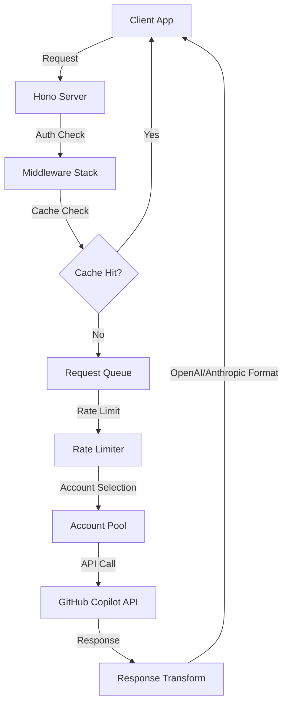

<p align="center">
  
</p>

<h1 align="center">Copilot API</h1>

<p align="center">
  <strong>Proxy server yang mengkonversi GitHub Copilot API ke format OpenAI & Anthropic — dengan dashboard management mobile-friendly untuk multi-account, quota monitoring, dan API playground.</strong>
</p>

<p align="center">
  <a href="https://github.com/el-pablos/copilot-api/actions"></a>
  
  
  
  
</p>

---

> **Peringatan**: Ini adalah reverse-engineered proxy dari GitHub Copilot API. Tidak didukung resmi oleh GitHub dan bisa berhenti berfungsi kapan saja. Gunakan dengan risiko sendiri.
>
> **Catatan Keamanan GitHub**: Penggunaan berlebihan atau otomatis terhadap Copilot bisa memicu sistem deteksi abuse GitHub. Pastikan kamu review [GitHub Acceptable Use Policies](https://docs.github.com/site-policy/acceptable-use-policies) dan [GitHub Copilot Terms](https://docs.github.com/site-policy/github-terms/github-terms-for-additional-products-and-features#github-copilot).

---

## Apa itu Copilot API?

**Copilot API** adalah proxy server yang bikin kamu bisa pakai GitHub Copilot dari tools apa aja yang support format OpenAI atau Anthropic API. Jadi kalau kamu punya akses GitHub Copilot, kamu bisa gunain buat:

- **Claude Code** — langsung connect tanpa perlu API key Anthropic
- **Tools OpenAI-compatible** — apapun yang bisa kirim request ke `/v1/chat/completions`
- **Custom app** — bikin aplikasi sendiri yang pakai model-model Copilot

Masalah yang diselesaikan: GitHub Copilot itu powerful banget, tapi API-nya proprietary dan nggak bisa dipake langsung sama tools third-party. Copilot API jadi jembatan antara Copilot dan ekosistem OpenAI/Anthropic.

## Fitur Utama

- **Multi-Format API** — Support OpenAI Chat Completions, Anthropic Messages, dan Embeddings
- **Dashboard Mobile-First** — WebUI management responsive yang bisa diakses dari HP
- **Multi-Account Pool** — Rotasi otomatis antar beberapa akun GitHub (4 strategi: sticky, round-robin, quota-based, hybrid)
- **Quota Monitoring** — Real-time tracking penggunaan per akun (Chat, Completions, Premium)
- **API Playground** — Test endpoint langsung dari dashboard dengan preset templates
- **Real-time Logs** — Server-Sent Events streaming log dengan filter dan export
- **Request History** — Audit trail lengkap semua request dengan cost estimation
- **Claude CLI Integration** — One-click config deployment untuk Claude Code
- **OAuth Device Flow** — Tambah akun GitHub tanpa copy-paste token
- **Rate Limiting** — Kontrol interval request dengan opsi wait atau error
- **Model Fallback** — Auto-fallback ke model lain kalau yang diminta nggak available
- **Cache & Queue** — Caching response dan queue management untuk reliability

## Arsitektur

### Request Pipeline

```
Client Request → Hono Server → Middleware (CORS, Auth, Logging)
    → Cache Check → Queue → Rate Limit → Account Pool Selection
    → Copilot API → Response Transform (OpenAI/Anthropic format) → Client
```

### Komponen Utama

| Komponen     | Lokasi                    | Deskripsi                              |
| ------------ | ------------------------- | -------------------------------------- |
| CLI Entry    | `src/main.ts`             | Command definitions pakai Citty        |
| Server       | `src/server.ts`           | Hono app dengan middleware stack       |
| Startup      | `src/start.ts`            | Server orchestration, token refresh    |
| Account Pool | `src/lib/account-pool.ts` | Multi-account rotation (4 strategi)    |
| Token Mgmt   | `src/lib/token.ts`        | GitHub & Copilot token handling        |
| Config       | `src/lib/config.ts`       | File-based config dengan env overrides |
| WebUI        | `src/webui/routes.ts`     | Dashboard API routes                   |
| Frontend     | `public/`                 | Alpine.js + Tailwind CSS dashboard     |

### Struktur Folder

```
copilot-api/
├── src/
│   ├── main.ts              # CLI entry point
│   ├── server.ts             # Hono server setup
│   ├── start.ts              # Server orchestration
│   ├── lib/                  # Core libraries
│   ├── routes/               # API route handlers
│   ├── services/             # External service clients
│   └── webui/                # Dashboard API
├── public/
│   ├── index.html            # Dashboard UI (mobile-first)
│   ├── js/app.js             # Alpine.js application
│   └── favicon.svg           # Logo
├── tests/                    # Unit & integration tests
└── .github/workflows/        # CI/CD pipelines
```

## Diagram Flow



## Cara Install & Setup

### Prerequisites

- [Bun](https://bun.sh) >= 1.2.x
- Akun GitHub dengan akses Copilot (Individual, Business, atau Enterprise)

### Install

```bash
# Clone repository
git clone https://github.com/el-pablos/copilot-api.git
cd copilot-api

# Install dependencies
bun install
```

### Autentikasi

```bash
# Login ke GitHub (OAuth device flow)
bun run auth
```

### Jalankan

```bash
# Development mode (hot reload)
bun run dev

# Production mode
bun run start

# Dengan custom port
PORT=8080 bun run start
```

Dashboard otomatis available di `http://localhost:4141`

## Konfigurasi

### Environment Variables

| Variable         | Default | Deskripsi                               |
| ---------------- | ------- | --------------------------------------- |
| `PORT`           | `4141`  | Port server                             |
| `DEBUG`          | `false` | Verbose logging                         |
| `WEBUI_PASSWORD` | -       | Password untuk dashboard WebUI          |
| `GH_TOKEN`       | -       | GitHub token (alternatif OAuth)         |
| `HTTP_PROXY`     | -       | HTTP proxy (dengan flag `--proxy-env`)  |
| `HTTPS_PROXY`    | -       | HTTPS proxy (dengan flag `--proxy-env`) |

### Config File

Konfigurasi disimpan di `~/.config/copilot-api/config.json`. Bisa diedit lewat dashboard WebUI atau langsung edit file JSON.

## Dashboard WebUI

Dashboard mobile-first yang bisa diakses langsung dari browser:

### Fitur Dashboard

- **Overview** — Statistik real-time, chart usage by model, runtime pulse
- **Model Catalog** — Browse semua model dengan filter vendor dan search
- **Usage & Quotas** — Detail quota per akun (Chat, Completions, Premium)
- **Account Pool** — Manajemen multi-account dengan OAuth flow
- **Real-time Logs** — Live streaming log dengan filter level, search, export
- **Settings** — Server config, Claude CLI integration, model mapping
- **Request History** — Audit trail paginated dengan filter dan cost tracking
- **API Playground** — Test endpoint langsung dengan preset templates

### Mobile Features

- 🎨 **Gruvbox Dark Theme** — Eye-friendly dark color scheme yang konsisten
- 📱 Responsive sidebar dengan hamburger menu dan swipe-to-close gesture
- 🔽 Bottom navigation bar dengan 5 quick access tabs
- 📊 Card view responsive untuk data tables
- 👆 Touch-friendly buttons (min 48px targets sesuai Material Design)
- ⌨️ Keyboard navigation dengan visible focus indicators & focus trap
- ♿ ARIA labels dan accessibility attributes komprehensif
- 📐 Safe area support untuk notched devices (iPhone X+)
- 🍞 Toast queue system dengan auto-dismiss dan swipe-to-dismiss
- 💀 Skeleton loading screens untuk better perceived performance

## API Endpoints

### OpenAI Compatible

| Method | Endpoint               | Deskripsi                              |
| ------ | ---------------------- | -------------------------------------- |
| POST   | `/v1/chat/completions` | Chat completions (streaming supported) |
| POST   | `/v1/embeddings`       | Text embeddings                        |
| GET    | `/v1/models`           | List available models                  |
| POST   | `/v1/responses`        | Responses API                          |

### Anthropic Compatible

| Method | Endpoint       | Deskripsi                          |
| ------ | -------------- | ---------------------------------- |
| POST   | `/v1/messages` | Messages API (streaming supported) |

### Utility

| Method | Endpoint  | Deskripsi        |
| ------ | --------- | ---------------- |
| GET    | `/health` | Health check     |
| GET    | `/usage`  | Usage statistics |
| GET    | `/token`  | Token info       |

## Commands

```bash
bun run dev              # Development mode dengan hot reload
bun run start            # Production mode
bun run build            # Build dengan tsdown
bun run lint             # Lint dengan ESLint
bun run typecheck        # TypeScript type checking
bun test                 # Jalankan semua test
bun run auth             # Autentikasi GitHub
bun run check-usage      # Cek quota Copilot
bun run debug            # Display debug info
```

---

<p align="center">
  
  
  
  
</p>

## Color Palette

Dashboard menggunakan **Gruvbox Dark** theme yang eye-friendly:

| Color            | Hex       | Usage                         |
| ---------------- | --------- | ----------------------------- |
| 🟠 Orange Bright | `#fe8019` | Primary accent, active states |
| 🟢 Green Bright  | `#b8bb26` | Success, online status        |
| 🔵 Blue Bright   | `#83a598` | Links, info badges            |
| 🟣 Purple Bright | `#d3869b` | Pool badges, secondary accent |
| 🟡 Yellow Bright | `#fabd2f` | Warnings, highlights          |
| 🔴 Red Bright    | `#fb4934` | Errors, destructive actions   |
| 🔵 Aqua Bright   | `#8ec07c` | Charts, cached status         |
| ⬛ Background    | `#1d2021` | Main background (hard)        |
| ⬜ Foreground    | `#ebdbb2` | Primary text                  |

## Kontribusi

Kontribusi terbuka! Silahkan buka issue atau pull request. Pastikan semua test passed sebelum submit PR.

## Lisensi

[MIT License](LICENSE) — Prasetyo Ari Wibowo
