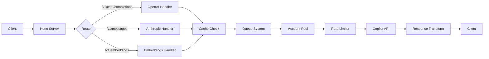

<div align="center">


# Copilot API

**Reverse-engineered proxy yang bikin GitHub Copilot bisa dipake sama tools OpenAI/Anthropic**

[](https://github.com/el-pablos/copilot-api/actions)
[](https://github.com/el-pablos/copilot-api/releases)
[](LICENSE)
[](https://bun.sh)
[](https://www.typescriptlang.org/)

[Instalasi](#instalasi) • [Cara Pakai](#cara-pakai) • [Arsitektur](#arsitektur) • [API Reference](#api-reference) • [Konfigurasi](#konfigurasi)

</div>

---

> **Heads up**: Ini reverse-engineered proxy, bukan official GitHub product. Bisa aja kapan-kapan gak work. Use at your own risk ya!

---

## Deskripsi

Copilot API adalah proxy server yang mentransformasi GitHub Copilot API jadi endpoint yang kompatibel sama OpenAI dan Anthropic. Lo bisa pake Copilot subscription lo sama tools kayak Cursor, Continue, Claude Code, atau aplikasi apapun yang support OpenAI/Anthropic API.

Basically, langganan GitHub Copilot lo jadi lebih "fleksibel" - bisa dipake di berbagai tools AI tanpa perlu bayar lagi.

### Fitur Utama

| Fitur                     | Deskripsi                                        |
| ------------------------- | ------------------------------------------------ |
| **Multi-API Support**     | OpenAI Chat Completions & Anthropic Messages API |
| **Account Pool**          | Rotasi otomatis buat ngindarin rate limit        |
| **Extended Thinking**     | Support Claude's adaptive thinking               |
| **Beautiful Dashboard**   | WebUI mobile-first buat monitoring               |
| **Smart Fallback**        | Auto-fallback ke model lain pas kena rate limit  |
| **Request Caching**       | LRU cache yang persist ke disk, hemat quota      |
| **Streaming Support**     | Full streaming support real-time                 |
| **Webhook Notifications** | Discord/Slack alerts buat quota low, errors, dll |

---

## Instalasi

### Prerequisites

- [Bun](https://bun.sh) >= 1.2.x
- GitHub Copilot subscription (Individual/Business/Enterprise)

### Quick Start

```bash
# Clone repo
git clone https://github.com/el-pablos/copilot-api.git
cd copilot-api
bun install

# Authenticate sama GitHub
bun run auth

# Start server (development)
bun run dev

# Atau production mode
bun run start
```

### Install via npm

```bash
# Global install
npm install -g copilot-api

# atau pake bunx langsung
bunx copilot-api
```

Server jalan di `http://localhost:4141`, dashboard juga available di URL yang sama.

---

## Cara Pakai

### Konfigurasi Client

Ganti base URL di aplikasi lo:

**OpenAI-compatible:**

```
Base URL: http://localhost:4141/v1
API Key: ghu_xxxx (atau dummy)
```

**Anthropic-compatible:**

```
Base URL: http://localhost:4141
API Key: ghu_xxxx (atau dummy)
```

### Dengan Claude Code

```bash
# Start server dengan opsi Claude Code
copilot-api start --claude-code

# Atau manual setup
ANTHROPIC_BASE_URL=http://localhost:4141 \
ANTHROPIC_AUTH_TOKEN=dummy \
ANTHROPIC_MODEL=gpt-4.1 \
claude
```

### Dengan OpenAI SDK

```typescript
import OpenAI from "openai";

const client = new OpenAI({
  baseURL: "http://localhost:4141/v1",
  apiKey: "dummy", // API key gak dipake, tapi required
});

const response = await client.chat.completions.create({
  model: "gpt-4.1",
  messages: [{ role: "user", content: "Hello!" }],
  stream: true,
});

for await (const chunk of response) {
  process.stdout.write(chunk.choices[0]?.delta?.content || "");
}
```

### Dengan Anthropic SDK

```typescript
import Anthropic from "@anthropic-ai/sdk";

const client = new Anthropic({
  baseURL: "http://localhost:4141",
  apiKey: "dummy",
});

const response = await client.messages.create({
  model: "claude-sonnet-4-20250514",
  max_tokens: 1024,
  messages: [{ role: "user", content: "Hello!" }],
});

console.log(response.content);
```

### Dengan curl

```bash
# Chat completion (OpenAI format)
curl http://localhost:4141/v1/chat/completions \
  -H "Content-Type: application/json" \
  -d '{
    "model": "gpt-4.1",
    "messages": [{"role": "user", "content": "Hello!"}]
  }'

# Messages (Anthropic format)
curl http://localhost:4141/v1/messages \
  -H "Content-Type: application/json" \
  -d '{
    "model": "claude-sonnet-4-20250514",
    "max_tokens": 1024,
    "messages": [{"role": "user", "content": "Hello!"}]
  }'
```

---

## Arsitektur

### Request Flow



### Struktur Direktori

```
copilot-api/
├── src/
│   ├── main.ts           # CLI entry point (citty)
│   ├── server.ts         # Hono app setup + middleware
│   ├── start.ts          # Server bootstrap & initialization
│   ├── auth.ts           # GitHub OAuth flow
│   │
│   ├── lib/              # Core utilities
│   │   ├── account-pool.ts        # Multi-account management
│   │   ├── config.ts              # File-based config
│   │   ├── request-cache.ts       # LRU caching
│   │   ├── request-queue.ts       # Concurrent request handling
│   │   ├── reasoning.ts           # Thinking/reasoning utilities
│   │   ├── token.ts               # Token management
│   │   ├── state.ts               # Runtime state
│   │   └── ...
│   │
│   ├── routes/           # API endpoints
│   │   ├── chat-completions/      # OpenAI /v1/chat/completions
│   │   ├── messages/              # Anthropic /v1/messages
│   │   ├── embeddings/            # OpenAI /v1/embeddings
│   │   ├── models/                # GET /models
│   │   └── responses/             # OpenAI Responses API
│   │
│   ├── services/         # External services
│   │   ├── copilot/               # GitHub Copilot API client
│   │   └── github/                # GitHub OAuth & API
│   │
│   └── webui/            # Dashboard API routes
│
├── public/               # WebUI frontend (Alpine.js)
├── tests/                # Test files
└── dist/                 # Build output
```

### Account Pool Strategies

| Strategy      | Deskripsi                       | Kapan Pake            |
| ------------- | ------------------------------- | --------------------- |
| `sticky`      | Pake akun yang sama sampe error | Default, simple usage |
| `round-robin` | Rotasi berurutan tiap request   | Load balancing rata   |
| `quota-based` | Pilih berdasarkan sisa quota    | Maximize quota usage  |
| `hybrid`      | Sticky + auto-rotate pas error  | **Recommended!**      |

---

## API Reference

### OpenAI Endpoints

| Endpoint               | Method | Deskripsi                                 |
| ---------------------- | ------ | ----------------------------------------- |
| `/v1/chat/completions` | POST   | Chat completion (streaming/non-streaming) |
| `/v1/embeddings`       | POST   | Text embeddings                           |
| `/v1/models`           | GET    | List available models                     |
| `/v1/responses`        | POST   | OpenAI Responses API                      |

### Anthropic Endpoints

| Endpoint       | Method | Deskripsi              |
| -------------- | ------ | ---------------------- |
| `/v1/messages` | POST   | Anthropic Messages API |

### Utility Endpoints

| Endpoint          | Method | Deskripsi                  |
| ----------------- | ------ | -------------------------- |
| `/health`         | GET    | Health check               |
| `/usage`          | GET    | Usage statistics           |
| `/token`          | GET    | Current Copilot token info |
| `/account-limits` | GET    | Account quota/limits       |

### WebUI API

| Endpoint           | Method   | Deskripsi                  |
| ------------------ | -------- | -------------------------- |
| `/`                | GET      | Dashboard                  |
| `/api/config`      | GET/POST | Get/update configuration   |
| `/api/accounts`    | GET/POST | List/add pool accounts     |
| `/api/cache/stats` | GET      | Cache statistics           |
| `/api/cache/clear` | POST     | Clear cache                |
| `/api/logs/stream` | GET      | Real-time log stream (SSE) |

---

## Konfigurasi

Config file ada di `~/.config/copilot-api/config.json`

### Environment Variables

| Variable         | Default | Deskripsi             |
| ---------------- | ------- | --------------------- |
| `PORT`           | `4141`  | Server port           |
| `DEBUG`          | `false` | Debug logging         |
| `GH_TOKEN`       | -       | GitHub token          |
| `WEBUI_PASSWORD` | -       | Password buat WebUI   |
| `HTTP_PROXY`     | -       | HTTP proxy URL        |
| `HTTPS_PROXY`    | -       | HTTPS proxy URL       |
| `FALLBACK`       | `false` | Enable model fallback |

### CLI Options

```bash
copilot-api start [options]

Options:
  -p, --port <port>           Port (default: 4141)
  -v, --verbose               Verbose logging
  -d, --debug                 Debug mode
  -g, --github-token <token>  GitHub token langsung
  -c, --claude-code           Generate Claude Code command
  -f, --fallback              Enable model fallback
  --proxy-env                 Pake HTTP_PROXY/HTTPS_PROXY dari env
  --webui-password <pass>     Set WebUI password
```

### Contoh Config Lengkap

```json
{
  "port": 4141,
  "debug": false,
  "poolEnabled": true,
  "poolStrategy": "hybrid",
  "cacheEnabled": true,
  "cacheMaxSize": 1000,
  "cacheTtlSeconds": 3600,
  "queueEnabled": true,
  "queueMaxConcurrent": 3,
  "fallbackEnabled": false,
  "modelReasoningEfforts": {
    "gpt-5-mini": "low",
    "gpt-5.3-codex": "xhigh",
    "gpt-5.4": "xhigh"
  }
}
```

---

## Development

```bash
bun run dev        # Development server (hot reload)
bun run build      # Build project
bun test           # Run tests
bun run lint       # Lint code
bun run typecheck  # Type check
```

### Code Style

- **Imports**: Pake `~/*` alias buat `src/*`
- **Types**: Strict TypeScript, no `any`
- **Naming**: camelCase buat variables, PascalCase buat types
- **Modules**: ESNext only, no CommonJS

---

## Data Storage

| Path                                          | Deskripsi          |
| --------------------------------------------- | ------------------ |
| `~/.config/copilot-api/config.json`           | Configuration      |
| `~/.config/copilot-api/request-cache.json`    | Request cache      |
| `~/.local/share/copilot-api/github-token.txt` | GitHub token       |
| `~/.local/share/copilot-api/pool-state.json`  | Account pool state |
| `~/.local/share/copilot-api/usage-stats.json` | Usage statistics   |

---

## Troubleshooting

### Token expired

```bash
copilot-api auth
```

### Rate limit

1. Enable multi-account pool
2. Pake `hybrid` strategy
3. Enable request queue

### Model not found

1. Check available models: `GET /models`
2. Enable `fallbackEnabled: true`

### Cache issues

```bash
curl -X POST http://localhost:4141/api/cache/clear
```

---

## Kontributor

<a href="https://github.com/el-pablos/copilot-api/graphs/contributors">
  
</a>

---

## License

MIT License - lihat [LICENSE](LICENSE)

---

<div align="center">

**Made with yang penting works di Indonesia**

</div>
